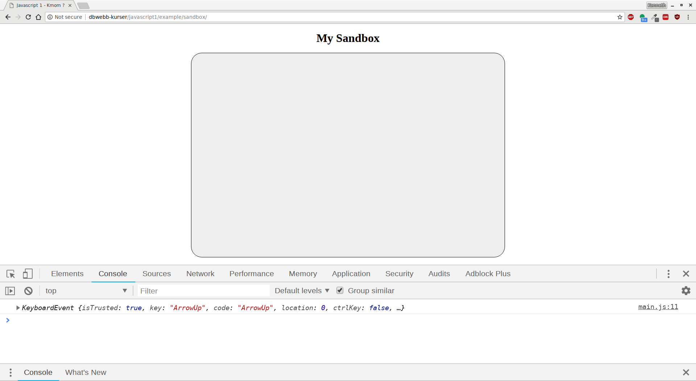
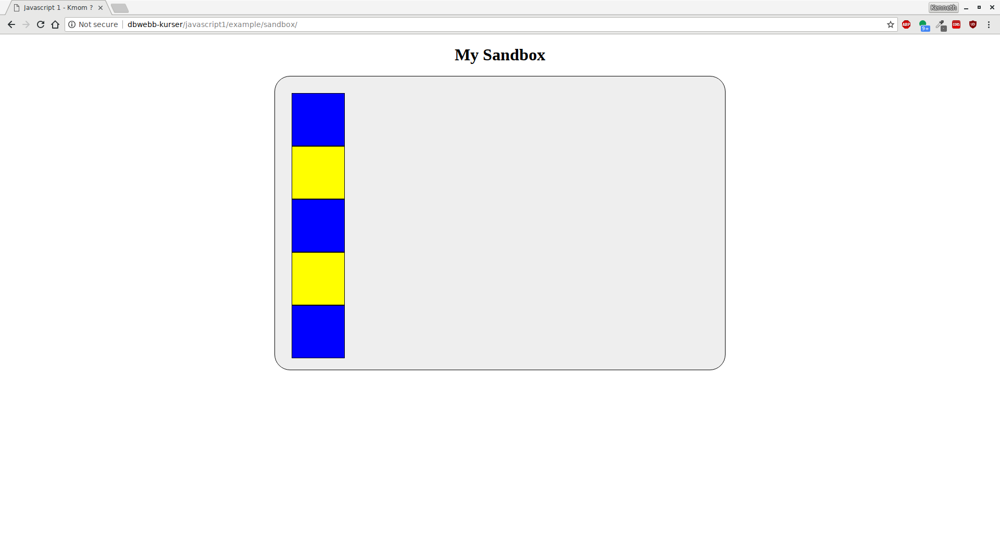

Eventlyssnare
=======================

En av JavaScripts styrkor är förmågan att lyssna på *event*. Det innebär att vi kan fånga upp när användaren klickar på något, när ett element förändras eller när en tangent trycks ner på tangentbordet. Vi kommer inte gå ner på djupet, utan vi håller oss vid ytan och skaffar oss en känsla för vad vi kan åstadkomma.

Vi utgår ifrån vår [sandbox](../../example/sandbox).


### KeyboardEvent

Vi börjar med att kika på ett event från tangentbordet. Ett event kan triggas när man trycker ner en tangent, när man håller nere den eller när man släpper upp tangenten. Det som skiljer dem åt är hur de initieras.


#### keydown

```js
document.addEventListener("keydown", function(event) {
  console.log(event)
})
```

Vi lägger eventlyssnaren direkt på `document`. Det skickas in två argument, eventnamnet `"keydown"` och en anonym funktion som körs automatiskt när eventet triggas. Argumentet `event` skickas med och innehåller hela eventet som triggas. För att enklare se vad som menas så kikar vi på hur det ser ut i consolen när vi skriver ut det:



Vi kan se att det är typen `KeyBoardEvent` och en uppsättning egenskaper vi kan använda. Klickar man på den lilla pilen till vänster dyker det upp en hel del fler. Jag tryckte på "uppåt-pilen" på tangentbordet och kan då se egenskapen `key` med värdet `ArrowUp`. Tidigare har webbläsarna använt sig av [ASCII-värden](http://www.asciitable.com/) för att hantera de olika tangenterna. Numera kan vi, i alla fall i Chrome och Firefox, använda oss utav den faktiska bokstaven eller tangenten.

Vi har alltså fångat eventet att en tangent trycks ner. All information hittar vi i `event`. Vi kikar på hur vi kan använda informationen:

```js
let myContent = document.getElementById('content')

myContent.innerHTML = "<h3>Press a letter in the word 'dbwebb':</h3>"

document.addEventListener("keydown", function(event) {
    let key = event.key // Catch the key property

    switch (key) {
        case "d":
        case "b":
        case "w":
        case "e":
            myContent.innerHTML += `<br>Good job, you pressed ${key}`
            break
        default:
            myContent.innerHTML += `<br>You pressed: ${key}`
    }
});
```

<!-- Vill du se mer kan du titta på videon som visar onkeydown:

[YOUTUBE src=pLt5tWcMt-s width=630 caption="Kenneth visar onkeydown."] -->


#### Övriga keyboard-events

Det finns som sagt fler events att fånga upp från tangentbordet. Det skiljer inte så mycket, utan definiera rätt event som argument till eventlyssnaren:

```js
document.addEventListener('keypress', ... )
document.addEventListener('keyup',  ... )
```


Läs mer om keyboard-events på [MDN](https://developer.mozilla.org/en-US/docs/Web/API/KeyboardEvent).


### MouseEvent


Det finns en uppsjö events kopplade till musen med. Vi tar den vanligaste varianten och kikar på. Eventen fångas upp på liknande sätt som för tangentbordet.


#### click

Istället för att lägga klick-eventet på `document` kan vi lägga det så det triggas om vi klickar på ett speciellt ställe. Vi skapar några lådor att leka med.

```html
<div class="box"></div>
<div class="box"></div>
<div class="box"></div>
<div class="box"></div>
<div class="box"></div>
```

Lite css på den skapar fina, fyrkantiga lådor.

```css
.box {
    height: 100px;
    width: 100px;
    border: 1px solid black;
    background-color: yellow;
}
```

Vi hämtar lådorna med javascript och lägger på en eventlyssnare, som triggas när man klickar i respektive låda.

```js
let boxes = document.getElementsByClassName("box")

for (let i = 0; i < boxes.length; i++) {
  boxes[i].addEventListener("click", function(event) {
    event.target.style.backgroundColor = "blue"
  })
}
```

Först och främst hämtar vi lådorna via klassnamnet. Vi loopar igenom lådorna och lägger på klick-eventet och använder konstruktionen `event.target.style.backgroundColor` för att byta bakgrundsfärg till blå. Med `event.target` når vi just det elementet vi klickat på och kan således använda samma eventlyssnare till alla lådor.


#### Resultat

Vi kör koden och om jag klickar på varannan låda blir det på följande sätt:




### Övriga mouse-events

Även här finns det fler events att fånga upp. Det skiljer heller inte så mycket, utan definiera rätt event som argument till eventlyssnaren. Några självförklarande exempel är:

```js
boxes[i].addEventListener("mouseover", ...)
boxes[i].addEventListener("mouseenter", ...)
boxes[i].addEventListener("mouseleave", ...)
boxes[i].addEventListener("dblclick", ...)

// etc
```
